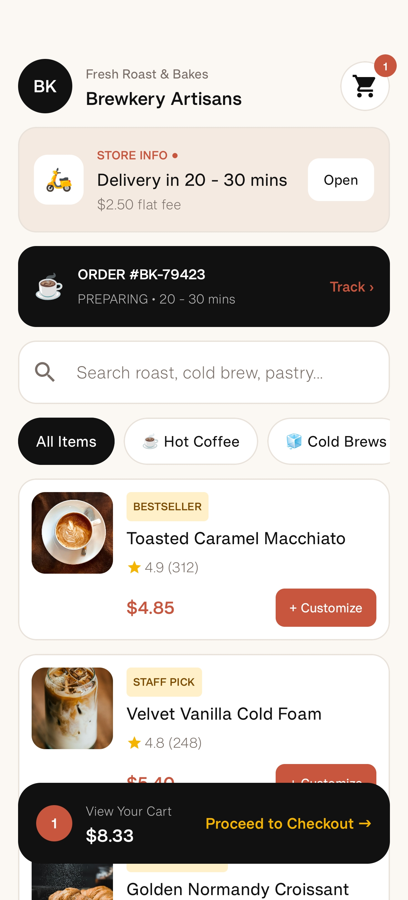
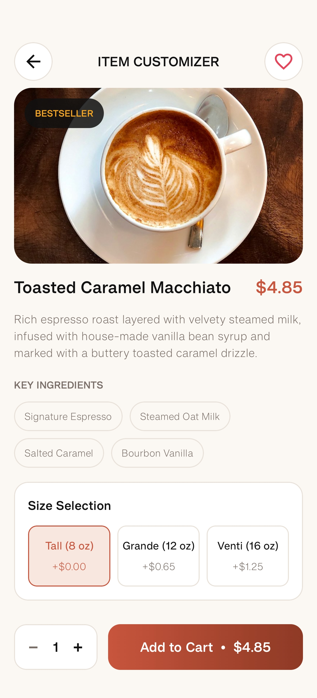
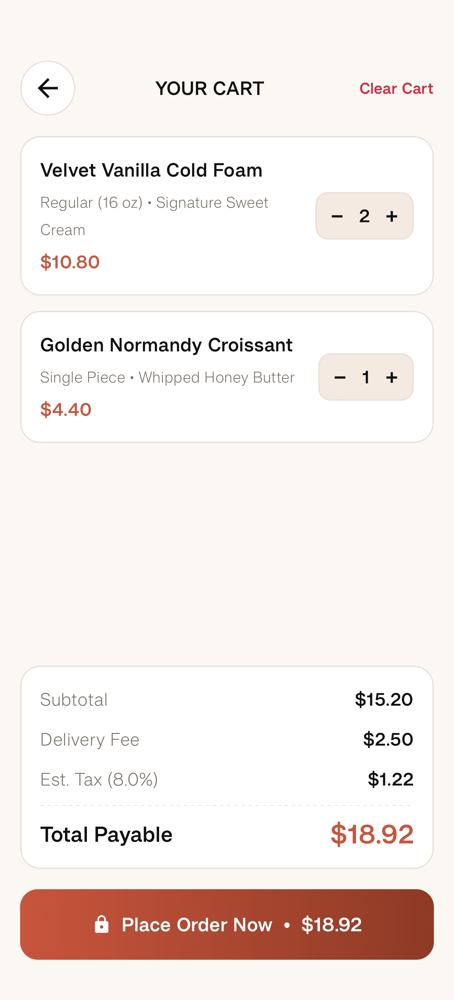
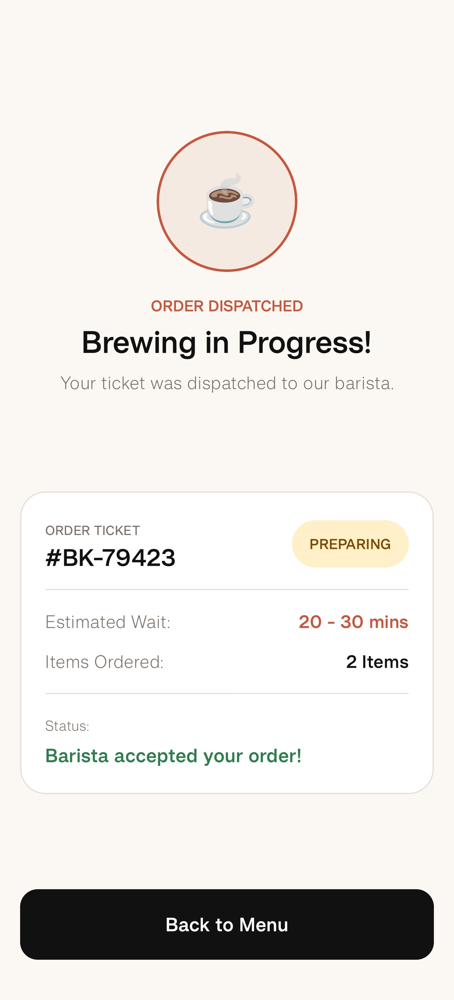

# Brewkery

Brewkery is an Android coffee and bakery ordering application built with Kotlin and Jetpack Compose. Based on the current project structure, it focuses on a clean ordering flow from menu discovery to order confirmation.

## Project Overview

Brewkery provides a straightforward in-app ordering journey:

1. **Menu browsing**: Explore drink and bakery items, search, and filter by categories.
2. **Product detail/customization**: Open an item, select size/options, and add it to cart.
3. **Cart review**: Adjust quantities, review totals, and place the order.
4. **Order status**: View active order/ticket details and return to menu.

These flows are reflected in the `presentation` package (`menu`, `detail`, `cart`, `order`, and `navigation`).

## Screenshots

| Menu | Detail |
|---|---|
|  |  |
| *Menu screen* | *Detail/customization screen* |

| Cart | Order |
|---|---|
|  |  |
| *Cart screen* | *Order status screen* |

## Technology Stack

- **Language**: Kotlin
- **Platform**: Android
- **UI**: Jetpack Compose, Material 3
- **Dependency Injection**: Hilt
- **Networking**: Retrofit + Moshi
- **Persistence**: Room
- **Navigation**: Navigation Compose
- **Image Loading**: Coil
- **Build System**: Gradle (Kotlin DSL)
- **Java Compatibility**: Java 11 (`sourceCompatibility`/`targetCompatibility`)
- **SDK Levels (app module)**: compile SDK 37, target SDK 37, min SDK 24

## Setup and Build

### Prerequisites

- Android Studio (latest stable recommended)
- Android SDK for API level 37
- JDK 11

### Open in Android Studio

1. Clone the repository:
   ```bash
   git clone https://github.com/Ashusingla90/Brewkery.git
   ```
2. Open the cloned folder in Android Studio.
3. Let Android Studio sync Gradle dependencies.
4. Select the **app** run configuration.
5. Run on an emulator or physical Android device.

### Command-line build/test

From the project root:

```bash
./gradlew assembleDebug
./gradlew test
```

## Project Structure

Main code is under `app/src/main/java/com/example/brewkery/`:

- `data/` - Remote API, local Room database, mappers, and repository implementations
- `domain/` - Business models, repository interfaces, and use cases
- `presentation/` - Compose screens and view models, including:
  - `menu/`
  - `detail/`
  - `cart/`
  - `order/`
  - `navigation/`
- `ui/` - App theme definitions (colors, typography, Material theming)

## Use of AI Tools

AI tools were used as development assistance for brainstorming, documentation drafting, code explanation support, debugging guidance, and improving README wording. All suggestions were reviewed and adapted by the project author before inclusion.

## Contributing

Contributions are welcome. Please open an issue first to discuss significant changes before submitting a pull request.

Repository author: **Ashusingla90**

## License

No license has been specified yet for this repository. Please contact the author (**Ashusingla90**) before redistributing or reusing the project.
